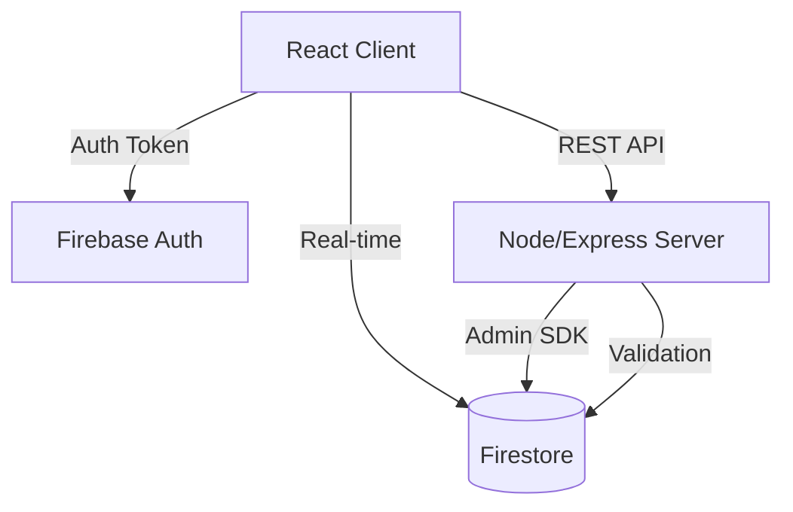

# 🏢 OfficeSync
### The Operating System for the Modern Workplace


**OfficeSync** is a full-stack solution designed to bridge the gap between physical office needs and digital management. By digitizing beverage procurement and internal communications, OfficeSync reduces administrative friction and enhances workplace culture through a responsive, real-time interface.

---

## 📸 Screenshots

| **Dashboard (Glassmorphism)** | **Notice Board (Paper/Cork)** |
|:---:|:---:|
|  |  |
| *Real-time analytics & Quick Actions* | *Interactive polls & pinned notices* |

---

## 🚀 Key Features

### ☕ Intelligent Beverage Logistics
- **Smart Time-Windows**: Server-side validation prevents ordering outside specific windows (Morning < 10:30 AM, Evening 3:00-5:30 PM).
- **Concurrency Control**: Firestore transactions ensure inventory accuracy even when multiple users order simultaneously.
- **Quick Re-order**: One-tap ordering based on your most frequent customization.

### 📌 The Digital Corkboard
- **Skeuomorphic Design**: "Sticky notes" with CSS-generated folded corners and pushpins.
- **Live Polling**: Real-time visualization of votes with duplicate-vote prevention.
- **Admin Controls**: Pin, lock, or delete threads instantly.

### 📊 Admin Analytics
- **Consumption Trends**: 7-day rolling average of beverage consumption.
- **Export Data**: One-click CSV export for monthly billing and vendor management.
- **User Management**: Role-based access control (RBAC) to manage staff and admins.

---

## 🏗️ Architecture

OfficeSync uses a **Hybrid Serverless** approach. Auth and DB are managed by Firebase for scalability, while complex business logic resides in an Express server.



## 🛠️ Deployment

### Prerequisites
- Node.js (v18+)
- Firebase Project with Firestore & Auth enabled

### Production Setup

1. **Server**
   ```bash
   cd server
   npm install
   # Create .env with strictly defined variables
   npm start
   ```

2. **Client**
   ```bash
   cd client
   npm install
   npm run build
   # Serve the 'dist' folder
   ```

## 📄 License
MIT

